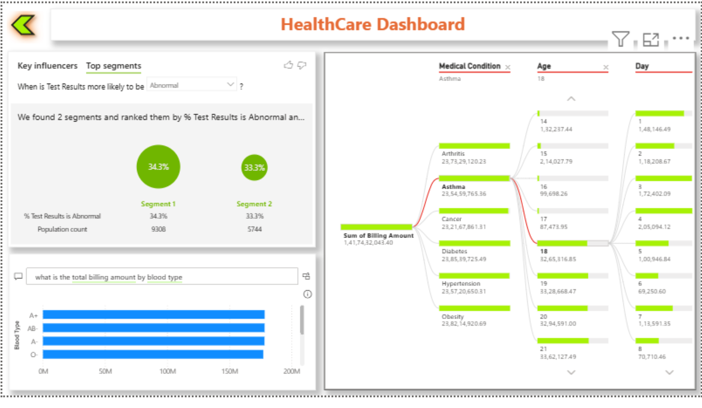

# Healthcare Data Analysis Dashboard

## Project Overview
This project presents an interactive Healthcare Data Analysis Dashboard built using Power BI. The dashboard provides insights into patient admissions, treatment costs, department performance, and healthcare trends to support data-driven decision-making.

## Tools & Technologies
- Power BI
- Microsoft Excel
- Data Cleaning
- Data Visualization
- DAX

## Dataset
The dataset contains healthcare-related information such as:
- Patient ID
- Admission Date
- Department
- Treatment Cost
- Diagnosis
- Doctor Information

## Key Features
- Patient admission trends over time
- Department-wise performance analysis
- Treatment cost distribution
- Interactive filters and slicers
- KPI metrics for quick insights

## Dashboard Insights
Some key insights derived from the dashboard:

- Identify departments with the highest patient load
- Track treatment cost patterns
- Monitor patient admission trends
- Compare department performance

## Dashboard Preview
- 
- 

## Project Files
- Healthcare.pbix → Power BI dashboard
- dataset.xlsx → Raw dataset
- dashboard.png → Dashboard screenshot

## How to Use
1. Download the repository
2. Open `Healthcare.pbix` using Power BI Desktop
3. Explore the interactive dashboard

## Author
Pragati Bankar
